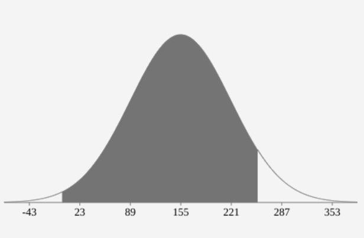
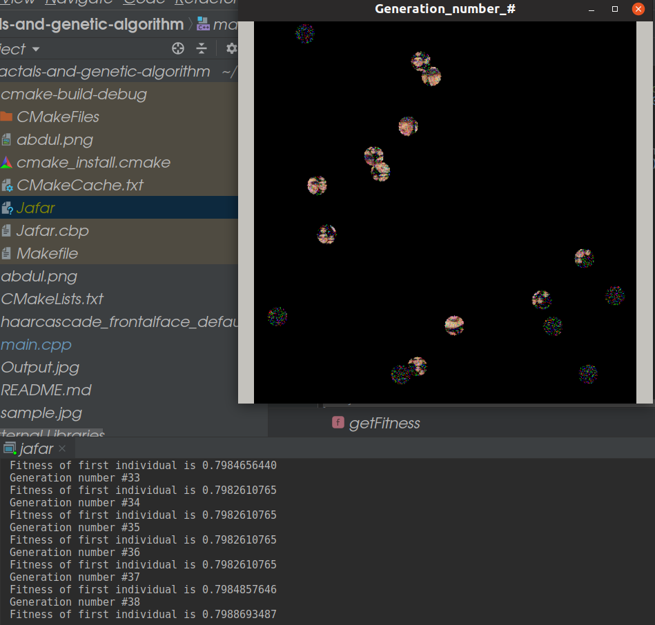
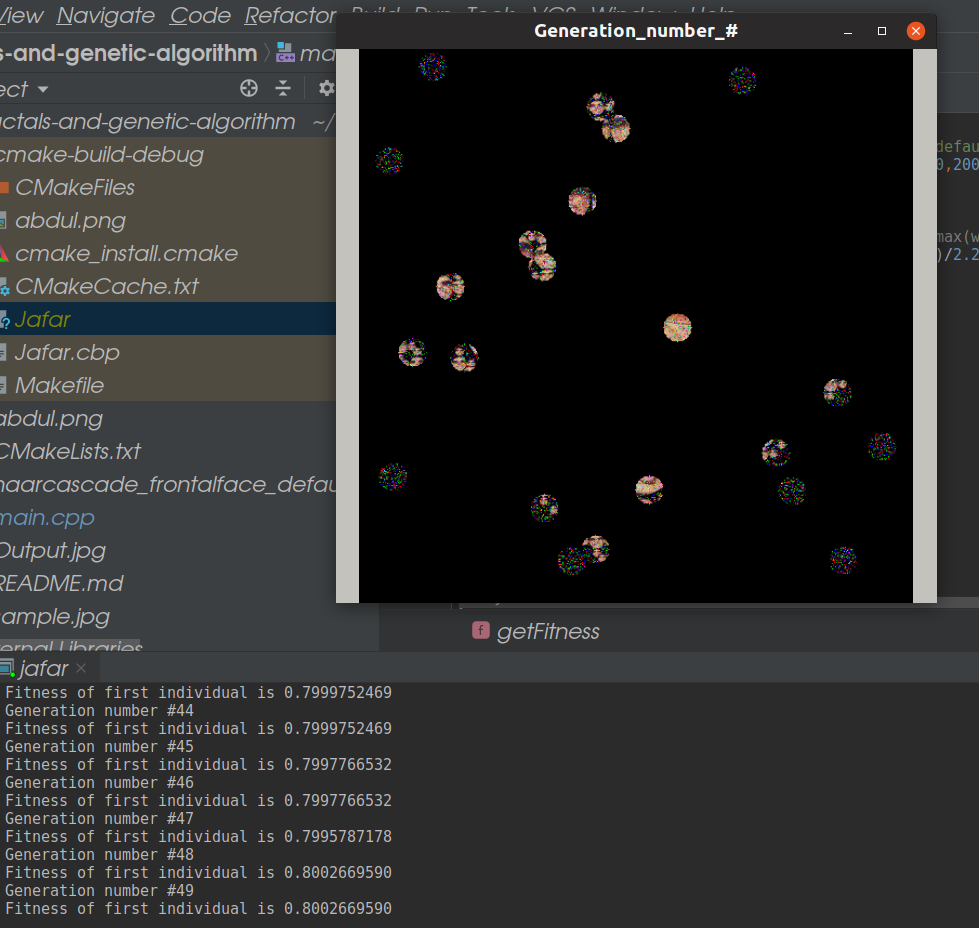
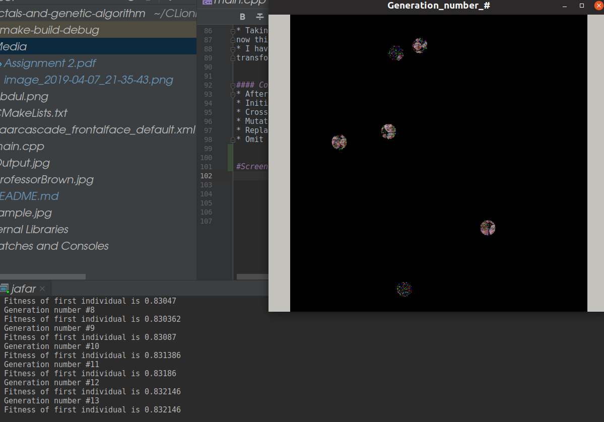

# Fractals-and-genetic-algorithm

## How to run the project without having opencv 

* I have added an executable file to this repository "jafar" without quotes
All you have to do is to run the following command in your terminal
 ```./jafar PICTURE1NAME.EXTENSION  NUMBEROFGENERATIONS``` Where the first argument is the name of the picture on the working directory and
 the second argument is the number of generation to be calculated until you will write 
the output picture to ```Output.jpg```.

* Beware that you will be able to see the progress of the program via terminal
in such a way that every generation it will show you the maximum fitness number of the 
generation and number of this generation to be processed.

## How to run with opencv installed (when editing the code)

* You just have to make sure you have cmake installed and run similar commands that are 
available in this repository. 
* Then when the opencv is compiled everything will workout automatically

## Algorithm 

### Face recognition via cascades

Best explaination for why using cascades is on [realpython](https://realpython.com/face-recognition-with-python/) here are some of the points they have made:
* OpenCV uses machine learning algorithms to search for faces within a picture. Because faces are so complicated, there isn’t one simple test that will tell you if it found a face or not. Instead, there are thousands of small patterns and features that must be matched. The algorithms break the task of identifying the face into thousands of smaller, bite-sized tasks, each of which is easy to solve. These tasks are also called classifiers.

* For something like a face, you might have 6,000 or more classifiers, all of which must match for a face to be detected (within error limits, of course). But therein lies the problem: for face detection, the algorithm starts at the top left of a picture and moves down across small blocks of data, looking at each block, constantly asking, “Is this a face? … Is this a face? … Is this a face?” Since there are 6,000 or more tests per block, you might have millions of calculations to do, which will grind your computer to a halt.

* To get around this, OpenCV uses cascades. What’s a cascade? The best answer can be found in the dictionary: “a waterfall or series of waterfalls.”

* After using the cascades in the xml file: original photo was cloned and
and transformed into gray scale (colors do not help with face recognition but sharp edges do so taking away the colors is crucial)
and then the coordinates of faces centers are given back by an array.
* One face is taking at random (as a circle) and fractale creation begins.
### Fractal

* **Koch snowflake** fractal is very famous and here I have used a special edition of my imagination
using the relation that each circle will have 4 tangent circles
such that the circles wont collide amongst themselves. 

* Given that ratio between new circle radius and old circle radius is ```X``` conclude that the biggest ratio that we could possible have is ```1/GR``` (```GR``` refers to the ```golden ratio```) which I have used this approximation ```1.618033988```.
* Now running depth first search so we can make our fractal of identical faces:

```
1. dfs(State(x,y),myParentFaceImage)
2. resizeMyParentFaceImage to new size(oldsize/GoldenRatio)
3. copyThisto the snippet that contains (x,y)
4. go_through_new_states_that_stem_from_this_state
```

### Genetic Algorithm Outline

#### Genes

* Genes in my algorithm are basically ```RGB``` picture variations such a way that the fittest is the closest for the optimal picture 
that have been made in the previous steps (We will talk about the fitness of these variations in latter sections)
so here for each individual we have ```512*512*3``` numbers which will identify this specific individual.
* Each sequential triplet will represent a pixel of the picture.
* At first all genes are black (No color) and afterwards they are filled with random data (via mutations and chromatic exchange)
#### Fitness Function
* In our world we will ignore multiple species emerging from our sample and we will always try to emit out these species (I use species here just to illustrate as if it was real world). so
here we will focus on the species that will look basically the closest to the optimal individual which we have created in the previous steps.
* Fitness is measured by the relative difference to the optimal and then it is calculated as the average
relative difference for all pixels having it varies in ``` [0, 1)```.
* The closest to 1 is the better.
* Function returns this value as a double.

#### Cross Over

* Having it as set of two function breed and crossOver.
* In crossover having two parents and the newborn child will have randomly selected chromosomes from either first or second parent (Just like what happens in human crossover).
* Here I am having population of size 10 and having all parents emitted after crossovers and it is fair enough to say
that these parents are digital spartians that will kill 35 children that are less fit for this digital world
* Next generation basically does the same thing.

#### Mutations 
* Since our optimal individual is the best one fit for this digital world it is obvious to conclude that generation after generation individuals are coming closer and closer
thus here using normal distribution I have chosen random values of mutation area and mutation pixel values relying on the ```std::normal distribution```.


* 
```In the above photo is representation of the normal distribution of probabilty of getting pixels betwen [0,255).``` 


* Taking a random circle with a reasonable size (via setting parameters to normal distribution) 
now this area will randomly mutate.
* I have sat normal distribution  parameters to favor these events that will happen so that it will serve faster 
transformation but the algorithm is working with any parameters just with different speeds.


#### Conclusion 
* After face recognition and fractal creation
* Initially having all black individuals 
* Crossover each pair
* Mutate some of the children
* Replace the population with the new population
* Omit out those who are further from the optimal image


#Screenshots during algorithm work

* 

* 

* 
* Beware it takes a lot of time 


